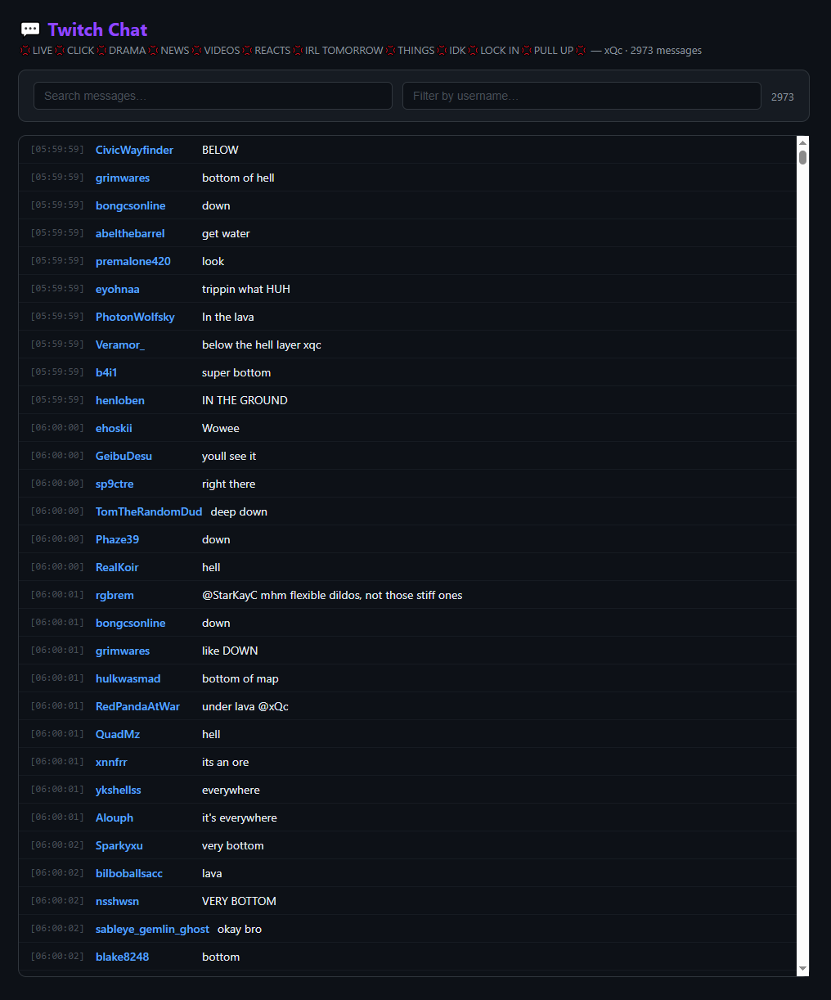

# Twitch Chat Downloader

> [🇬🇧 English](README.md) · [🇺🇦 Українська](README.uk.md)

Простое и быстрое приложение для скачивания чата с Twitch VOD. Экспорт в TXT, CSV или просмотр в браузере.


<p align="center">
  
</p>

## ✨ Возможности

- **🚀 Быстрая загрузка** — многопоточный парсинг: одновременно сканируются разные участки VOD
- **⚡ Высокая скорость** — до 16 потоков, значительно быстрее однопоточных аналогов
- **🎯 Точный тайминг** — скачивание чата за указанный промежуток времени (Start / End)
- **🖼️ Предпросмотр VOD** — миниатюра, название, канал и длительность перед загрузкой
- **📤 Три формата экспорта** — TXT, CSV или просмотр в браузере с поиском и фильтрацией
- **🌍 Мультиязычность** — русский, украинский, английский (переключение флагами)
- **🛑 Отмена в один клик** — кнопка Cancel в любой момент
- **⚙️ Настройка потоков** — регулируйте под своё соединение

## 📸 Скриншоты

<p align="center">
  
</p>

<p align="center">
  
</p>

## 📦 Установка

### Требования

- Windows 10 / 11
- Python 3.10 или выше
- pip

### Быстрый старт

```bash
git clone https://github.com/ZetHor3/twitch-chat-downloader.git
cd twitch-chat-downloader
pip install -r requirements.txt
python main.py
```

Или просто запустите `run.bat` — скрипт сам установит зависимости и откроет приложение.

## 🎮 Использование

1. **Вставьте ссылку на VOD** — например: `https://www.twitch.tv/videos/2796577649`
2. **Дождитесь загрузки превью** — приложение покажет название, канал и длительность
3. **(Опционально) Укажите тайминг** — Start / End для скачивания части чата
4. **Нажмите Download Chat** — начнётся многопоточная загрузка
5. **Экспортируйте результат** — TXT, CSV или Browser (просмотр + поиск/фильтр)

## 🧵 Настройка потоков

| Потоков | Скорость | Нагрузка на сеть |
|---------|----------|------------------|
| 1–2 | Низкая | Минимальная |
| 4–6 | Средняя | Рекомендуется |
| 8–16 | Высокая | Для быстрых соединений |

## 📁 Структура проекта

```
twitch-chat-downloader/
├── main.py                # Графическое приложение на PyQt6
├── chat_downloader.py     # Модуль скачивания чата (GQL)
├── worker.py              # Фоновый поток загрузки
├── l10n.py                # Локализация (EN/RU/UK)
├── requirements.txt       # Зависимости
├── run.bat                # Быстрый запуск на Windows
├── assets/
│   ├── logo.png           # Иконка приложения
│   └── flags/             # SVG-флаги
├── README.md              # Английская версия
├── README.ru.md           # Русская версия
└── README.uk.md           # Украинская версия
```

## 🛠️ Технические детали

- **Интерфейс**: PyQt6, кастомный рендеринг циклического прогресса и флагов через QPainter
- **API**: Twitch GQL (persisted query `VideoCommentsByOffsetOrCursor`)
- **Сканирование**: посегментное (шаг 30 секунд) — обход блокировки cursor-пагинации
- **Сеть**: httpx, многопоточность через `ThreadPoolExecutor`

## 📄 Форматы экспорта

### TXT
```
[00:00] username1: привет!
[00:05] username2: как дела?
[00:12] username1: норм
```

### CSV
```
id,username,message,time_in_video,timestamp
abc123,username1,привет!,0.0,2024-01-01T00:00:00Z
```

### Browser
Встроенная HTML-страница с поиском по тексту, фильтром по пользователям, сортировкой.

## 📜 Лицензия

MIT — делайте что хотите, но упоминание автора приветствуется.

## 👤 Автор

**ZetHor3** — [GitHub](https://github.com/ZetHor3)

---

<p align="center">
  <sub>Built with Python, PyQt6 and ❤️</sub>
</p>
